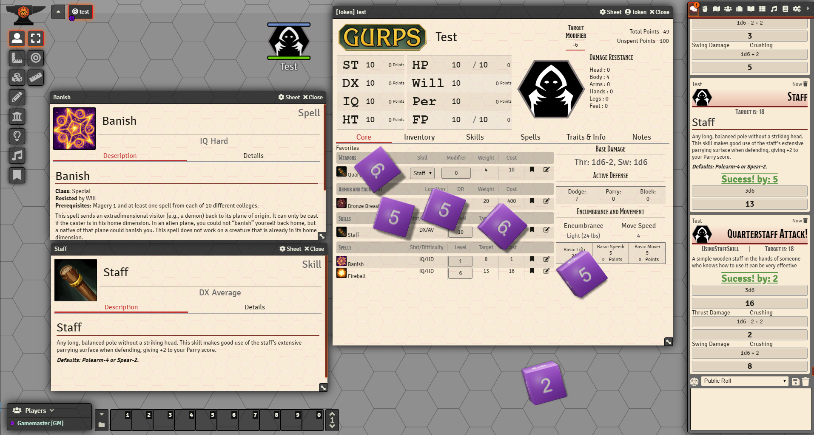

This is a simple to use implementation of the 4E GURPS character sheet for use with Foundry VTT. It should be compatible with foundry version 0.7.5 and higher.  Bugs, feedback or suggestions are welcome. The goal here is to provide a quick to setup and play system, not to automate the myriad modifiers and situational components of GURPS.  Any and all modifiers should be calculated and called by the players or GM and applied during play.  Using the alt key when clicking a roll button will provide a simple dialog to imput the modifier before rolling. No different than being at a physical table with paper character sheets.

We provide no pre-made skills, traits or other components, but you can easily build those from your GURPS books using the system!

GURPS is a trademark of Steve Jackson Games, and its rules and art are copyrighted by Steve Jackson Games. All rights are reserved by Steve Jackson Games. This Foundry VTT System is the original creation of David Rogers and is released for free distribution, and not for resale, under the permissions granted in the <a href="http://www.sjgames.com/general/online_policy.html">Steve Jackson Games Online Policy</a>.

Layout and HTML for the Notes tab was adapted from alt5e by Sky.  
https://github.com/Sky-Captain-13/foundry/tree/master/alt5e

<ul>
<li>TODO - Add info and layout items to the rolldown for owned items</li>
<li>TODO - Use second equipment location for DR application</li>
<li>TODO - Add ranged and melee attack information fields for spells</li>
<li>TODO - Implement block attribute on equipment to allow for shield skill and block </li>
<li>TODO - Create character template item </li>
<li>TODO - Prevent duplicate skills on character sheet </li>
<li>TODO - Beutification and Layout optimization - 85% complete</li>
<li>TODO - Make DR Locations to be more attractive (stick figure locations?)</li>
<li>TODO - Verify all strings have been localized</li>
<li>TODO - Update trait items to have trait type as subtitle at top of card.</li>
<li>TODO - Add level option for traits to allow for multi-level traits such as Magery</li>
<li>TODO - Implement Psionics</li>
<li>TODO - Implement Techniques</li>
<li>TODO - Implement NPC/Monser 'card' for a lightweight npc record</li>
<li>TODO - System settings - skin system based on 'theme' </li>
<li>TODO - Skins - set up Fantasy, Modern, Western, Cyberpunk and Sci-Fi themed css skins </li>
</ul>

<h3>0.6.8</h3>
<ul>

</ul>

<h3>0.6.7</h3>
<ul>
    <li>Sucess/Failure and margin on Rolls</li>
    <li>Call out Crit/Fumble on rolls</li>
    <li>Damage Rolls with attack/spell automatically</li>
    <li>Added damage option for spells</li>
    <li>beautified and consolidate items in chat cards</li>
</ul>

<h3>0.6.6</h3>
<ul>
    <li> implemented the alt key to apply a target modifier to the target on a roll.</li>
    <li> added a target modifier box to the header of the character sheet</li>
</ul>

<h3>0.6.5</h3>
<ul>
    <li>Implemented absolute basic damage rolls on attacks. currently works only on weapons will add spells etc later</li>
</ul>

<h3>0.6.4</h3>
<ul>
    <li>major overhaul of css to make layout more pleasant</li>
    <li>fixed damage formula bug </li>
    <li> initial damage on attack complete not fully implemented yet.</li>
</ul>

<h3>0.6.3</h3>
<ul>
    <li> fixed equipment options checkboxes resetting when added to character sheet</li>
    <li> settings for dr scope now reloads the app making changes happen on character sheets</li>
    <li> armor now calculates dr based on location depending on scope.</li>
    <li> Note armor items present valid locations based on scope moving scope will require that you set the correct scope</li>
    <li> implemented flexable/concealable armor and applied the stacking of those dc's by location<li>
</ul>

<h3>0.6.2</h3>
<ul>
    <li> added spell information to data model
    <li> added spell information fields to item sheet
</ul>

<h3>0.6.1</h3>
<ul>
    <li> updated data model for weapons to allow for multiple damage options</li>
    <li> updated weapon item card to lay ground work for implementing proper damage rolls</li>
    <li> added ability to add damage types to weapon items</li>
</ul>

<h3>0.6.0</h3>

<ul>
    <li> this is considered the first playable implementation - All core rules are usable with this sheet</li>
    <li> Implemented single location DR</li>
    <li> Updated css layout to make sheet more organized</li>
    <li> Implemented all rollable items</li>
</ul>

